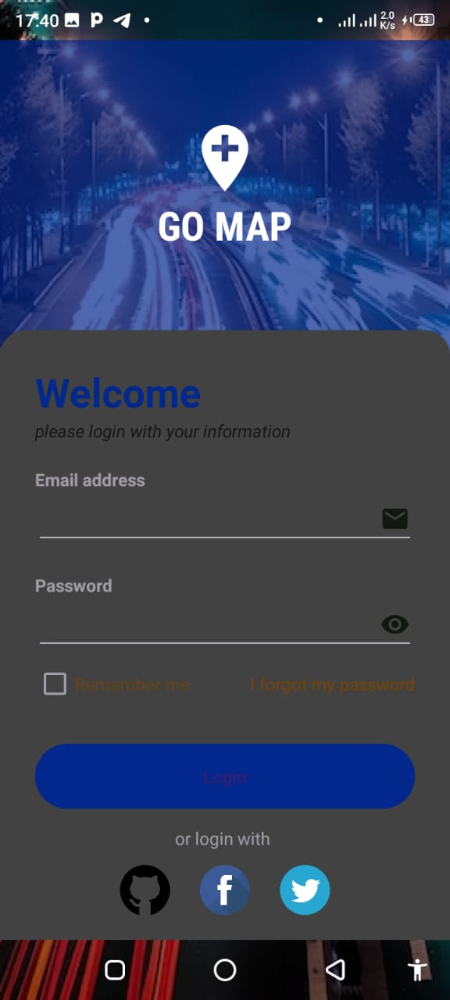

### Screenshot

# Simple Login Android App Template

This repository contains a basic Android app template for a login screen, designed to be simple and user-friendly.

## Features

- **Custom Background**: A drawable background (`@drawable/bg`) is applied to the main layout, enhancing the visual appeal.
- **Header Section**: Includes an icon and app name ("GO MAP") centered at the top, giving the app a clean, modern look.
- **CardView Login Form**: The login form is embedded within a `CardView` at the bottom of the screen, offering a sleek, professional design with rounded corners.
- **TextFields for Email and Password**: The input fields for email and password are clean and simple, with icons for better user interaction.
- **"Remember Me" Checkbox**: Allows users to select if their login details should be remembered for future sessions.
- **Forgot Password Option**: Includes a "Forgot Password" option for users to reset their password.
- **Login Button**: A `MaterialButton` is provided for user login, styled with rounded corners and a clean interface.
- **Social Media Login Options**: Three icons for GitHub, Facebook, and Twitter are included, making it easy to integrate social login functionality.

## Layout Structure

The layout is constructed using various Android components such as:

- `RelativeLayout`: The main container that holds other elements.
- `LinearLayout`: Arranges the login form vertically with proper padding and alignment.
- `CardView`: Wraps the login form at the bottom, giving a structured and stylish appearance.
- `TextView` and `EditText`: For displaying text and capturing user input, respectively.
- `MaterialButton`: A button for users to log in, following Material Design guidelines.

## How to Use

1. Clone or download the project.
2. Open it in Android Studio.
3. Customize the layout and functionality as needed.
4. Build and run the project on an Android device or emulator.

---

This template serves as a starting point for implementing a fully functional login screen in Android applications.
